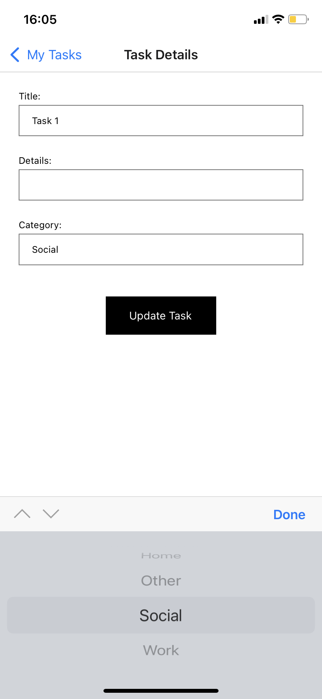

# Task Manager App
A simple task management app developed with React Native.

## Technologies and Libraries
- React Native
- Firebase (Firestore)

## Running the Project
1. Run `npm install` in the project directory.
2. Set the Firebase configuration (`services/firebase.js` file).
3. Start the application with the `npm start` command in the project directory.

## Project Structure
- `screens/`: Application screens.
- `services/`: Firebase service functions.
- `components/`: Application components.

## Screenshots

## Develop and Contribute
1. Fork.
2. Create a new branch: `git checkout -b feature/branch-name`
3. Commit the changes: `git commit -m 'add new feature'`
4. Push the branch: `git push origin feature/branch-name`
5. Open a pull request.
